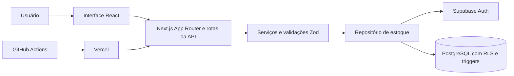
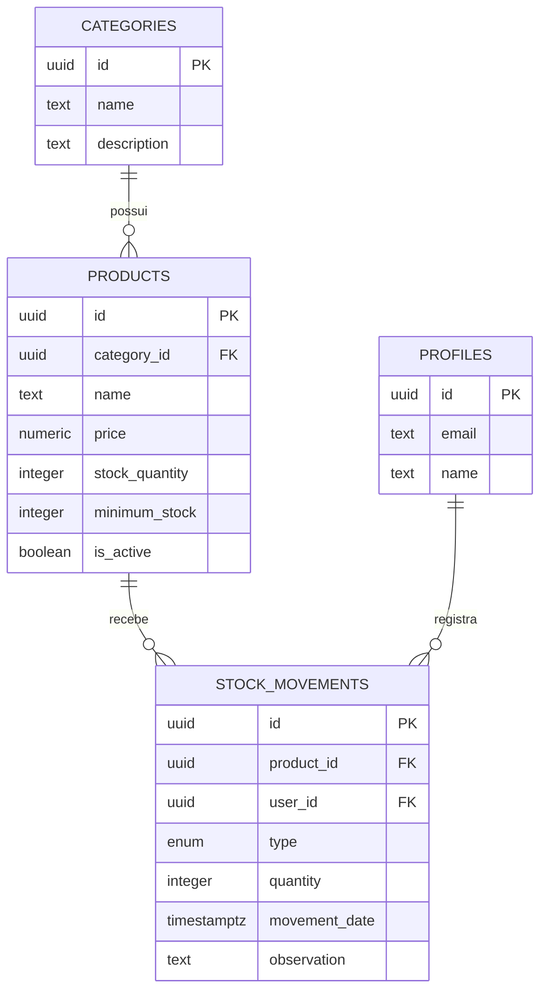

# Documentação técnica

## Visão geral

O projeto foi desenvolvido como uma aplicação web de controle de estoque para um desafio técnico. O foco foi atender o fluxo principal com clareza: categorias, produtos, entradas, saídas, saldo e histórico.

A aplicação publicada usa o Supabase online para autenticação e banco de dados. O Next.js funciona como a camada intermediária entre a interface e o Supabase, evitando que a interface acesse diretamente as regras de negócio.

## Arquitetura



O fluxo de uma operação é:

1. o usuário interage com um formulário React;
2. a interface envia a requisição para uma rota da própria aplicação;
3. a rota confirma a sessão do usuário;
4. o serviço valida os dados com Zod;
5. o repositório executa a operação no Supabase;
6. o PostgreSQL aplica as restrições e atualiza o saldo;
7. a resposta volta para a interface.

## Tecnologias usadas

| Tecnologia | Uso no projeto |
|---|---|
| Next.js 16 | App Router, páginas, Server Components, Server Actions, rotas da API e proxy de sessão |
| React 19 | Formulários, filtros, diálogos e componentes interativos |
| TypeScript | Tipagem das entidades, filtros, serviços e respostas |
| Tailwind CSS 4 e next-themes | Estilos, responsividade e temas claro/escuro |
| shadcn/ui e Radix UI | Botões, tabelas, diálogos, menus, campos e alertas acessíveis |
| Supabase Auth | Autenticação da conta de avaliação |
| Supabase PostgreSQL | Persistência de categorias, produtos, perfis e movimentações |
| Row Level Security | Restrição de acesso às tabelas para usuários autenticados |
| Zod | Validação dos dados recebidos pelas rotas da API |
| Recharts | Gráficos do dashboard |
| Vitest | Testes automatizados das validações e regras principais |
| ESLint | Análise estática do código |
| GitHub Actions | Execução automática de lint, tipos, testes e build |
| Vercel | Hospedagem e deploy conectado ao GitHub |

## Organização do código

```text
src/app
  (app)            páginas autenticadas
  api              rotas usadas pela interface
  login            tela e ação de autenticação

src/components     componentes visuais e formulários
src/lib
  auth             sessão e autenticação
  repository       acesso aos dados
  supabase         cliente Supabase no servidor
  inventory-service.ts  regras da aplicação
  validation.ts    schemas Zod

supabase/migrations  estrutura e regras do PostgreSQL
scripts              criação do usuário de avaliação
docs                 documentação do projeto
```

As páginas do App Router são Server Components por padrão. A interatividade foi isolada em componentes cliente, como os formulários, filtros.

## Modelo de dados



### Categorias

As categorias organizam os produtos. O nome é obrigatório, possui limite de 80 caracteres e não pode ser repetido ignorando diferenças entre letras maiúsculas e minúsculas.

Uma categoria com produtos vinculados não pode ser excluída.

### Produtos

Cada produto pertence a uma categoria e possui nome, descrição, preço, saldo, estoque mínimo e situação ativa ou inativa.

O saldo não pode ser alterado diretamente pelas operações comuns. Quando um produto é criado com estoque inicial, a função `create_product_with_initial_stock` cria o produto e registra uma movimentação de entrada.

Produtos sem histórico podem ser excluídos. Produtos com movimentações são inativados para não quebrar a rastreabilidade.

### Movimentações

As movimentações podem ser de `entrada` ou `saida`. Cada registro armazena produto, usuário, quantidade, data e observação.

A quantidade deve ser um número inteiro maior que zero. Movimentações não são editadas ou excluídas pela aplicação.

## Atualização e proteção do saldo

A regra mais importante está no PostgreSQL.

Antes de inserir uma movimentação, o trigger `stock_movements_apply_balance` executa a função `private.apply_stock_movement`. Essa função:

1. confirma que existe um usuário autenticado;
2. bloqueia a linha do produto com `SELECT ... FOR UPDATE`;
3. verifica se o produto existe e está ativo;
4. rejeita quantidades inválidas;
5. impede uma saída maior que o saldo;
6. associa a movimentação ao usuário autenticado;
7. atualiza o saldo dentro da mesma transação.

O bloqueio da linha evita que duas saídas simultâneas usem o mesmo saldo e deixem o estoque negativo.

## Autenticação e autorização

O usuário informa o nome `Climba`, mas o Supabase Auth autentica a conta pelo e-mail configurado no servidor. Esse e-mail não precisa ser exibido na tela de login.

A sessão é mantida em cookies com `HttpOnly`, `SameSite=Lax` e `Secure` em produção. O proxy do Next.js atualiza os cookies da sessão quando necessário.

As páginas protegidas e as rotas da API confirmam o usuário no servidor. No banco, as políticas de Row Level Security permitem acesso somente ao papel `authenticated`.

Além das políticas, os privilégios por coluna impedem a alteração direta de `stock_quantity`. O saldo só muda pelas funções e triggers de movimentação.

## Rotas da aplicação

| Método | Rota | Responsabilidade |
|---|---|---|
| GET/POST | `/api/categories` | Listar e criar categorias |
| PUT/DELETE | `/api/categories/[id]` | Editar e excluir uma categoria |
| GET/POST | `/api/products` | Listar e criar produtos |
| GET/PUT/DELETE | `/api/products/[id]` | Consultar, editar, excluir ou inativar um produto |
| GET/POST | `/api/stock-movements` | Listar e registrar movimentações |
| GET | `/api/dashboard` | Retornar indicadores e dados dos gráficos |

As rotas retornam erros de validação e de regra de negócio com códigos HTTP adequados, sem expor detalhes internos do banco.

## Dashboard

O dashboard consulta categorias, produtos e movimentações em paralelo. A partir desses dados são calculados:

- quantidade de produtos ativos;
- total de categorias;
- produtos abaixo do estoque mínimo;
- produtos sem saldo;
- unidades recebidas no mês;
- entradas e saídas dos últimos sete dias;
- distribuição por categoria;
- últimas movimentações;
- produtos que exigem atenção.

## Validação e testes

Os schemas Zod validam:

- tamanho e obrigatoriedade dos nomes;
- preço com até duas casas decimais e valor não negativo;
- estoque inicial e mínimo como inteiros não negativos;
- quantidade da movimentação como inteiro positivo;
- data válida;
- observações com até 500 caracteres.

Os comandos usados para verificar o projeto são:

```powershell
pnpm lint
pnpm typecheck
pnpm test
pnpm build
```

O workflow de integração contínua repete esses quatro comandos em cada pull request e em cada atualização do `main`.

## Ambientes e publicação

### Desenvolvimento

O desenvolvimento pode usar o mesmo Supabase online configurado em `.env.local`. Não é necessário executar o Supabase localmente.

Existe um adaptador demonstrativo em memória restrito ao ambiente não produtivo, usado como apoio em desenvolvimento e no build do CI. Ele não é uma instalação local do Supabase e nunca é ativado em produção.

### Produção

O repositório do GitHub está conectado à Vercel. Uma alteração integrada ao `main` inicia um novo deploy de produção.

A produção recebe somente as variáveis necessárias para conexão com o Supabase e identificação da conta de avaliação. A chave administrativa usada na criação do usuário não fica no runtime da aplicação.

## Decisões de escopo

O projeto prioriza o que demonstra as regras centrais do desafio. Recursos como múltiplos depósitos, pedidos de compra, notificações externas e integrações fiscais não foram adicionados porque aumentariam o escopo sem melhorar a avaliação do controle de saldo.

Se o sistema evoluísse, as próximas melhorias seriam filtro por período, exportação do histórico em CSV, paginação e gestão de diferentes níveis de acesso.
